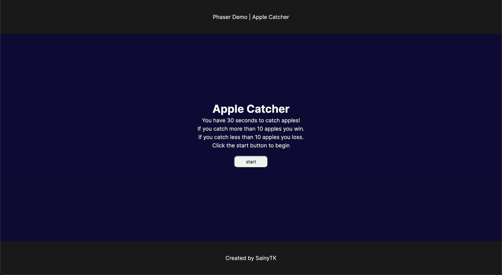
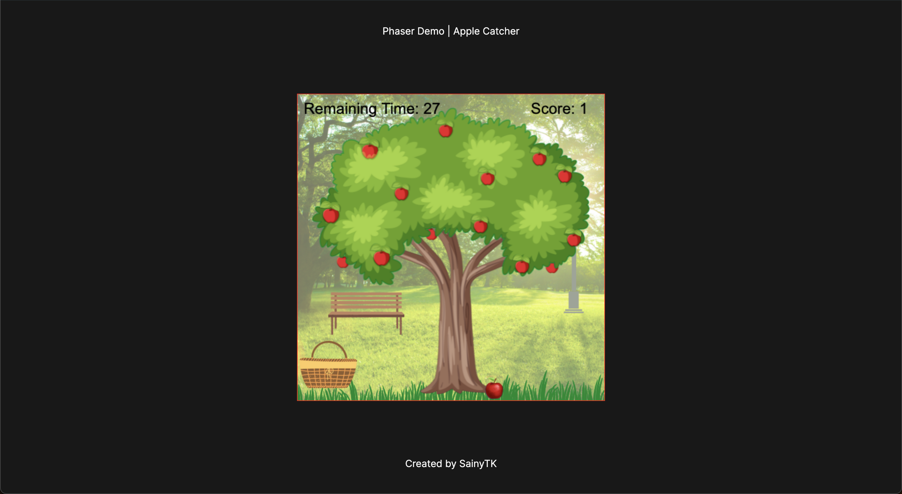
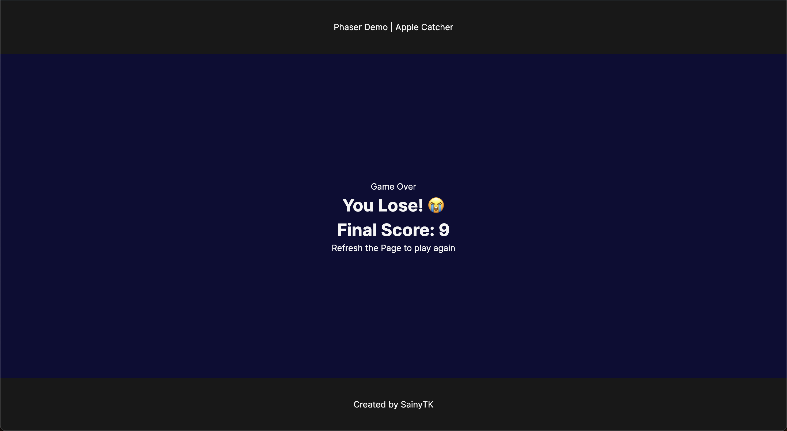

# Learn Phaser

## Description

This is my first learning project on Phaser 2D gaming. Here I learned the basic syntax of the framework and builts a simple apple picking game.


## Key points

- Phaser project setup with Vite + Vanilla TypeScript
- Page setup with HTML and CSS
- Phaser scene object and its structure
- Loading assets to the scene
- Using image asset as player and objects in the game
- Enabling gravity
- Play movement
- Collision
- Score system
- Game Timer
- Audio
- Simple particle system
- Game UI

## Installation

1. Clone the repository:
2. Navigate to the project directory:
3. Install dependencies:
    ```sh
    npm install
    ```

## Usage

1. Start the development server:
    ```sh
    npm run dev
    ```
2. Open your browser and navigate to `http://localhost:5173` to see the project in action.

## Screenshots

1. Game Start


2. Game Play


3. Game Over
